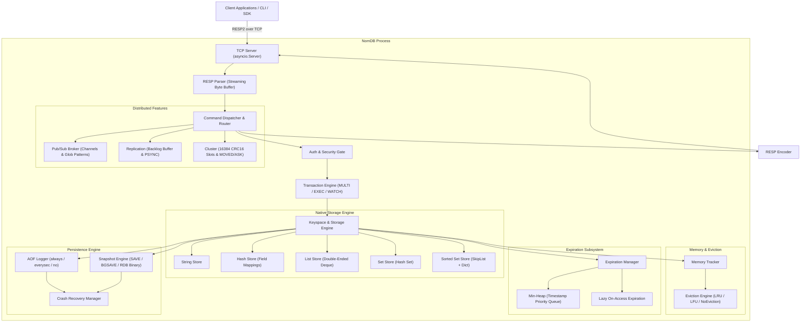

# NomDB Architecture & Design Specification

**NomDB** is an asynchronous, high-performance in-memory key-value database built completely from scratch in Python 3.13+ using `asyncio` and standard library components, with zero external database wrappers or Redis delegation.

---

## 1. High-Level System Architecture

---

## 2. Layer-by-Layer Breakdown

### 2.1 Networking Layer (`nomdb.server`)
* **Asynchronous TCP Server**: Created via `asyncio.start_server` using standard non-blocking POSIX / Windows sockets with `TCP_NODELAY`.
* **Connection Lifecycle**: Tracks client connection objects, buffers, auth status, active database selection, and subscriptions.
* **Graceful Lifespan**: Handles `SIGINT`, `SIGTERM`, and `SHUTDOWN` commands by stopping new connection acceptance, saving state snapshots, flushing the AOF buffer, closing clients, and terminating cleanly.

### 2.2 Protocol Engine (`nomdb.protocol`)
* **RESP2/RESP3 Streaming Parser**: Consumes variable-length TCP chunks into a stateful zero-unnecessary-copy byte buffer.
* **Fragmentation Handling**: Gracefully handles split frames across multiple `recv()` calls, multiple pipelined commands within a single TCP packet, and malformed inputs with explicit `ProtocolError` responses.
* **Supported RESP Types**:
  * Simple Strings (`+OK\r\n`)
  * Errors (`-ERR ...\r\n`, `-WRONGTYPE ...\r\n`, `-MOVED ...\r\n`)
  * Integers (`:1000\r\n`)
  * Bulk Strings (`$6\r\nfoobar\r\n`, Null: `$-1\r\n`)
  * Arrays (`*2\r\n$3\r\nGET\r\n$3\r\nfoo\r\n`, Null: `*-1\r\n`)

### 2.3 Command Engine & Dispatcher (`nomdb.commands`, `nomdb.server.dispatcher`)
* **Dynamic Command Registry**: Commands are registered with metadata defining arity, write vs. read characteristics, administrative permissions, and time complexity.
* **Pipelining & Execution**: Commands are processed sequentially per connection without blocking independent client connections.
* **Lifecycle Hooks**: Write commands trigger memory eviction checks, AOF persistence logging, and replication propagation to connected replicas.

### 2.4 Storage Engine & Native Data Structures (`nomdb.storage`)
* **Keyspace**: Central key dictionary storing `StorageEntry` headers containing:
  * `data_type`: DataType Enum (`STRING`, `HASH`, `LIST`, `SET`, `ZSET`)
  * `value`: Native data structure object
  * `expire_at_ms`: Absolute expiration epoch milliseconds (or `None`)
  * `created_at_ms`: Timestamp of key creation
  * `last_accessed_at_ms`: High-resolution timestamp for LRU eviction
  * `access_count`: Logarithmic frequency counter for LFU eviction
* **Sorted Sets (SkipList)**:
  * Implemented from scratch using a multi-level probabilistic SkipList with node span pointers and a reverse pointer chain.
  * Secondary hash index `dict[member, score]` allows $O(1)$ score lookups and existence verification.
  * Rank queries (`ZRANK`, `ZREVRANK`) and element queries by rank execute in $O(\log N)$ time by traversing spanning distances without scanning the entire list.

### 2.5 Expiration & Memory Management (`nomdb.expiration`, `nomdb.memory`)
* **Dual Expiration Strategy**:
  1. *Lazy Expiration*: Keys are inspected for expiration during every read/write lookup (`get_entry`), purging expired keys on the fly.
  2. *Active Expiration*: Periodic background worker inspects an indexed min-heap (`heapq` of `(expire_timestamp, key)`) and samples keyspace batches without stalling the event loop.
* **Memory Eviction**:
  * Tracks memory allocation approximations for all data structures.
  * When `maxmemory` threshold is crossed, triggers eviction based on policy (`allkeys-lru`, `volatile-lru`, `allkeys-lfu`, `volatile-lfu`, `noeviction`).

### 2.6 Persistence & Crash Recovery (`nomdb.persistence`)
* **Append-Only File (AOF)**: Records write commands as RESP arrays to disk. Supports `appendfsync` modes: `always`, `everysec`, `no`. Features background AOF rewriting.
* **Snapshotting (RDB-style)**: Point-in-time binary serialization saving magic bytes `NOMDB01`, database indices, type tags, expiration timestamps, data payloads, and SHA-256 checksums. Supports non-blocking `BGSAVE`.
* **Crash Recovery**: Automatically reconciles persisted files on startup, tolerating truncated frames and restoring expiration queues.

### 2.7 Transactions (`nomdb.transaction`)
* `MULTI` / `EXEC` / `DISCARD`: Commands within transaction blocks are queued per connection and executed atomically during `EXEC`.
* `WATCH` / `UNWATCH`: Implements optimistic concurrency control by tracking key modification version counters.

### 2.8 Pub/Sub Broker (`nomdb.pubsub`)
* Channel subscriptions and glob-style pattern subscriptions (`news.*`).
* Real-time zero-copy broadcast to subscriber connections.

### 2.9 Replication (`nomdb.replication`)
* Primary-replica architecture with full synchronization (`FULLRESYNC`) and partial synchronization (`PSYNC`).
* Bounded circular memory ring buffer (`ReplicationBacklog`) storing cumulative write offsets.
* Replica nodes enforce `READONLY` execution for mutating client commands.

### 2.10 Hash-Slot Cluster (`nomdb.cluster`)
* 16,384 hash slots computed via CRC16 (`CRC16(key) % 16384`).
* Redis-style hash tags `{user_123}` for co-locating multi-key operations to the same slot.
* Redirection responses (`-MOVED <slot> <ip>:<port>`).
