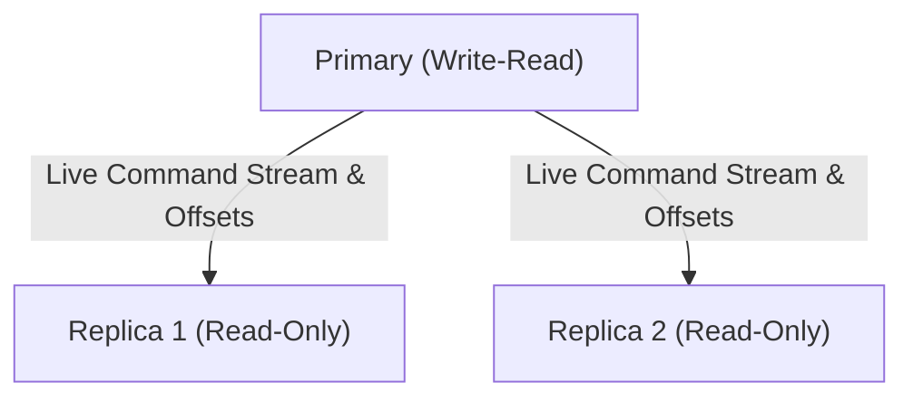

# NomDB Primary-Replica Replication

NomDB implements asynchronous primary-replica replication with offset tracking, replication backlogs, and automatic partial resynchronization (PSYNC).

---

## 1. Replication Topology

---

## 2. Replication Lifecycle & Handshake

1. **Connection**: Replica establishes TCP connection to Primary.
2. **Ping**: Replica sends `PING` to verify link availability.
3. **Port Announce**: Replica sends `REPLCONF listening-port <port>`.
4. **PSYNC Request**: Replica sends `PSYNC <master_replid> <offset>`.
   * **Full Resync (`+FULLRESYNC`)**: If it is the replica's first connection or if the replica offset has fallen out of the backlog window, the primary transmits full keyspace state.
   * **Partial Resync (`+CONTINUE`)**: If the replication ID matches and the requested offset is within the backlog buffer window, the primary transmits only the delta command stream since the replica's last offset.
5. **Real-time Propagation**: Every mutating command executed on the primary is written to `ReplicationBacklog` and forwarded across the socket connection to all registered online replicas.
6. **Heartbeat & Lag**: Primary sends periodic `PING` heartbeats. Replicas acknowledge received offsets via `REPLCONF ACK <offset>`.
